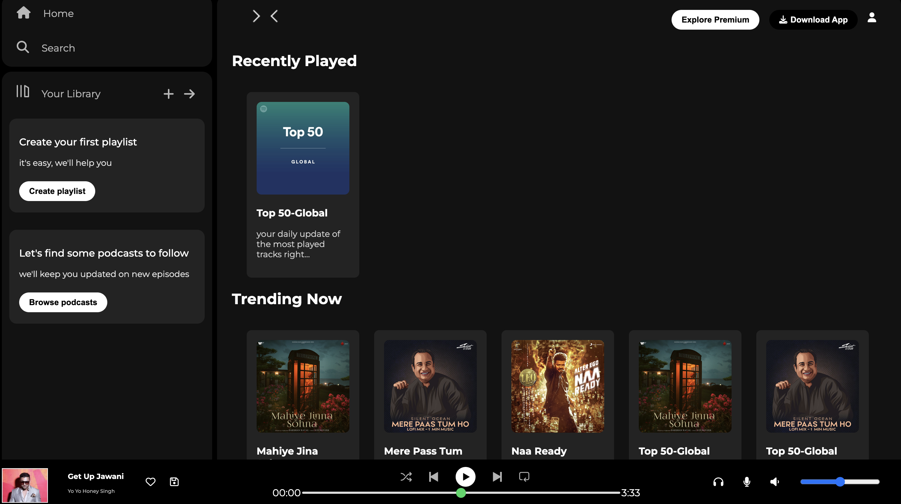
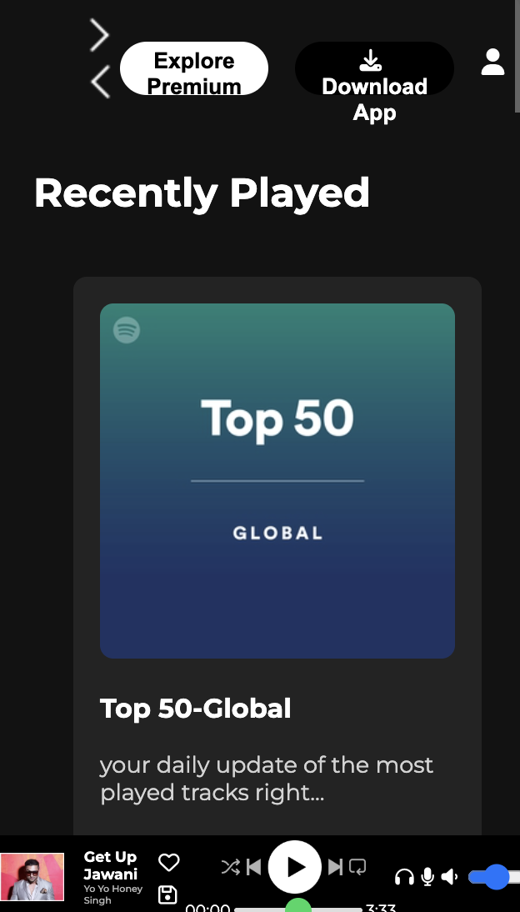

# 🎵 Spotify Clone - Responsive Music Player

A fully responsive Spotify-inspired music player built with HTML, CSS, and JavaScript. This project recreates the modern Spotify interface with a focus on responsive design and user experience.




## 🌟 Features

- **Responsive Design**: Works seamlessly across all devices (desktop, tablet, mobile)
- **Modern UI**: Clean, dark theme inspired by Spotify's interface
- **Interactive Music Player**: Bottom player with controls and progress bar
- **Sidebar Navigation**: Home, Search, and Library sections
- **Card-based Layout**: Music cards with hover effects
- **Font Awesome Icons**: Professional iconography throughout
- **Mobile-First Approach**: Optimized for mobile devices


## 🚀 Live Demo

[View Live Demo](https://funny-chaja-1565c0.netlify.app/) 

## 📱 Responsive Breakpoints

- **Desktop**: 1200px and above
- **Large Tablets**: 1000px - 1199px
- **Small Tablets**: 768px - 999px
- **Mobile**: 480px - 767px
- **Small Mobile**: 360px - 479px

## 🛠️ Technologies Used

- **HTML5**: Semantic markup
- **CSS3**: Flexbox, Grid, Media Queries
- **Font Awesome**: Icons
- **Google Fonts**: Montserrat font family

## 📁 Project Structure

```
spotify-clone/
├── index.html
├── style.css
├── README.md
├── assets/
│   ├── logo.png
│   ├── library_icon.png
│   ├── forward_icon.png
│   ├── backward_icon.png
│   ├── player_icon1.png
│   ├── player_icon2.png
│   ├── player_icon3.png
│   ├── player_icon4.png
│   ├── player_icon5.png
│   ├── card1img.jpeg
│   ├── card2img.jpeg
│   ├── card3img.jpeg
│   ├── card4img.jpeg
│   ├── card5img.jpeg
│   └── card6img.jpeg
└── LICENSE
```

## 🎨 Key Components

### 1. **Sidebar Navigation**
- Home and Search options
- Your Library section
- Create playlist and browse podcasts cards

### 2. **Main Content Area**
- Sticky navigation with user options
- Recently Played section
- Trending Now grid
- Featured Charts

### 3. **Music Player**
- Album artwork and song info
- Playback controls (previous, play/pause, next, etc.)
- Progress bar with time display
- Volume and additional controls

## 📱 Mobile Features

- **Collapsible Sidebar**: Hides on mobile for more content space
- **Responsive Cards**: Adapts to screen size
- **Touch-Friendly Controls**: Optimized for mobile interaction
- **Scalable Text**: Maintains readability across all devices

## 🔧 Installation & Setup

1. **Clone the repository**
   ```bash
   git clone https://github.com/sagarkatoch/spotify-clone.git
   ```

2. **Navigate to project directory**
   ```bash
   cd spotify-clone
   ```

3. **Open in browser**
   ```bash
   # Simply open index.html in your browser
   # Or use a local server like Live Server in VS Code
   ```

## 🎯 Usage

1. Open `index.html` in your web browser
2. Explore the responsive design by resizing the browser window
3. Click on navigation items and music cards (static for now)
4. Test the music player controls
5. View on different devices to see responsive behavior

## 🌐 Browser Support

- ✅ Chrome (recommended)
- ✅ Firefox
- ✅ Safari
- ✅ Edge
- ✅ Mobile browsers

## 🎨 Customization

### Colors
The project uses Spotify's color scheme:
- **Primary Green**: `#1bd760`
- **Background**: `#000000`
- **Cards**: `#121212`
- **Sidebar**: `#232323`

### Fonts
- **Primary Font**: Montserrat (Google Fonts)
- **Icons**: Font Awesome 6.7.2

## 🔮 Future Enhancements

- [ ] Add JavaScript functionality for music playback
- [ ] Implement search functionality
- [ ] Add playlist creation and management
- [ ] Connect to Spotify API for real data
- [ ] Add dark/light theme toggle
- [ ] Implement user authentication
- [ ] Add keyboard shortcuts
- [ ] Create custom audio visualizer

## 🤝 Contributing

Contributions are welcome! Please feel free to submit a Pull Request.

1. Fork the project
2. Create your feature branch (`git checkout -b feature/AmazingFeature`)
3. Commit your changes (`git commit -m 'Add some AmazingFeature'`)
4. Push to the branch (`git push origin feature/AmazingFeature`)
5. Open a Pull Request

## 📝 License

This project is licensed under the MIT License - see the [LICENSE](LICENSE) file for details.

## 🙏 Acknowledgments

- Spotify for design inspiration
- Font Awesome for icons
- Google Fonts for typography
- The web development community for tutorials and inspiration

## 📧 Contact

Sagar Katoch - katochsagar2@gmail.com

Project Link: [https://github.com/sagarkatoch/spotify-clone](https://github.com/sagarkatoch/spotify-clone)

---

⭐ If you like this project, please give it a star on GitHub! ⭐

